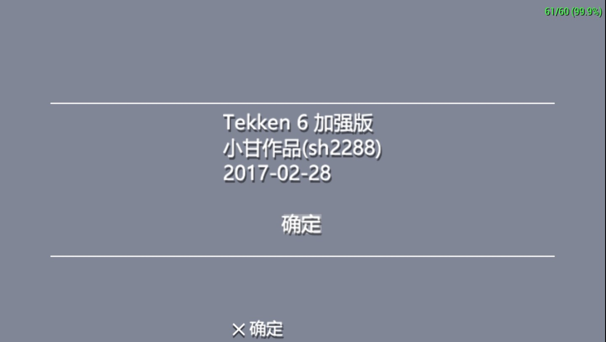

# PSP铁拳6_hack修改版(tekken6_PSP_hack)
[ISO下载地址](https://github.com/sh2288/tekken6_PSP_hack/releases)
## 这事儿是16年--17年干的 [博客存档](https://blog.sina.com.cn/sh2288)
## 相关技术会陆续放出...

# 版本特性

1. 主菜单音乐替换
2. 英文版显示日版段位(日文版照样显示日版段位)
3. ghost无限模式,25个地图场景乱入,对手添加最终boss,和nancy机器人,随机出现
4. 练习模式全地图可选
5. 装备自定义服装时可以直接购买斗气(aura,ki),直接买即可(原版不能) 
6. 加入金钱全满和怒气(rage)全开效果的秘籍
使用方法:进入练习模式,选择Anger of the Earth一次,即可令金钱最大,同时怒气效果全开
7. 联机地图23个,比街机还多!(联机去掉黑屏和练习有墙,练习无墙),此游戏全地图26个
8. 联机菜单的背景音乐去除(方便挂机,可挂着先干其他事情)若有人挑战时可听到提示音
9. 减少联机延迟(去掉部分地图动态模型),网络缓冲池参数参照PSP铁拳5修改 
10. 解决602版某些地图闪退的问题
11. 保留所有原始音乐的基础上,对部分场景的音乐少量更改(日文版保持不变)
12. 只有在对战联机时才使用精简的场景(一方面减少延迟,另一方面有些图不精简无法联机)
# Feature
1. Main menu music changed
2. Eng language show JP RANK(Jp language still show JP RANK)
3. GHOST BATTLE 25 stages random ,final boss and nancy will appeared random
4. PRACTICE MODE can select all stages
5. profile customize can use AURA(KI) without default clothes(just buy!)
6. add max gold hack add all rage open hack
Useage:
go practice mode & select Anger of the Earth ,then max gold got and all rage open
next version will add this hack(enjoy!)
7. Online battle lobby can select 23 stages(this game total 26 stages,battle lobby org only 4 stages)
8. Online battle lobby BG music remove
9. Online battle lobby delay optimization (part of the optimization model of stages)
10. fix 602 ver some stage load error in battle lobby mode
11. stage bg changes swich to jpn means go back org bg music

# 支持(Support)
[Paypal](https://paypal.me/sh228800?country.x=C2&locale.x=zh_XC)

微信

