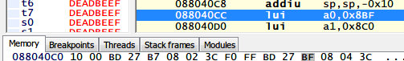
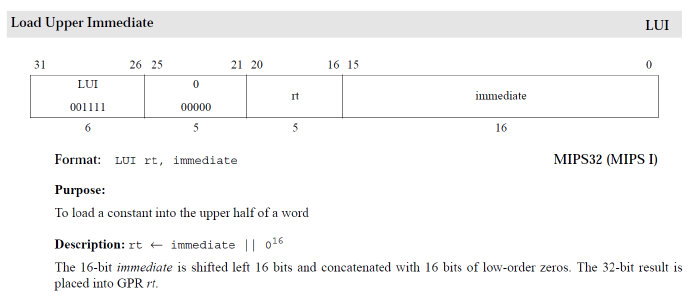

# 利用PPSSPP反汇编功能,HACK PSP游戏教程1-2016-09-22
一句话,PSP hack就是修改eboot
(修改eboot中的指令代码,达到更改程序的目的)
譬如不减血,金钱最大化,增加功能等等任何你能想到的要求
1. 轻微了解mips指令(自备指令集手册,遇到不会的就查)
2. 会一点编程
3. PSP游戏的结构(基本上都是主程序+资源),也可以理解成eboot + bin,这样
4. 能看懂16进制数据,psp是32位,所以大多数情况还要会翻转着看懂16进制的数据

1,2,有兴趣的自己谷歌或百度
PSP游戏的结构
众所周知,PSP的游戏都是以UMD为载体发行的,UMD的区段为0x800字节 = 2048字节
也可以用lba理解,PSP ISO LBA自行百度
个人觉得应该先理解区段再了解LBA,LBA就是记录光盘数据列表而已,当然如果很多的话,也比较烦,但也只是烦而已...
所以0x800字节很重要,因为游戏中的偏移地址,有些指的是区段,并不是实际的偏移
而且实际中的资源数据都是0x800的整数倍
所以
区段 * 0x800 = 实际的偏移地址
PSP游戏的程序部分就是eboot.bin,游戏启动时eboot会全部载入到指定区域的内存中
所以PSPhack就是对eboot.bin进行更改,对游戏资源的更改,应该叫mod(这个更改并不能改变游戏的程序)
以PSP铁拳6为例(其他psp游戏基本不玩)
下图R4 反汇编窗口左边是寄存器窗口,右边是指令,下面是内存浏览窗口
mips中zero寄存器,永远是0x00000000
hi和lo寄存器适用于乘法计算时或进位的高低位寄存器
右边窗口的指令(主程序)

088040cc lui a0,0x8bf
内存 mips32指令
实际上这个内存的32位数据为3C0408BF

对应的eboot为
mips lui 指令解释

088040cc lui a0,0x8bf
所以这条指令表示将0x8bf给寄存器a0的高位
即 a0 = 0x08bfxxxx
......
这样说好像容易蒙
算了,明天再写